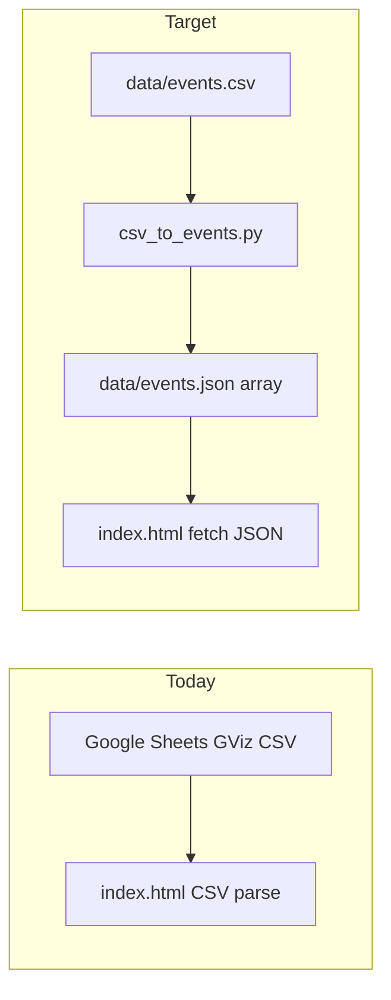

# Full PWA checklist + canonical `data/events.csv` pipeline

## Current state

- **[index.html](index.html)** loads the schedule via **GViz CSV** (`SPREADSHEET_ID`, `fetchScheduleCsvText`, `sheetRowsToEvents`, `deriveEndsAndDuration`) and derives **`event.id`** in `init()` from `startUtcMs` + stage + summary (violates finalized identity rule).
- **[data/events.json](data/events.json)** is a legacy **`{"events":[...]} `** envelope with **`startTime`/`endTime` strings**, no **`id`** — incompatible with the plan’s **top-level array** runtime contract.
- **No** [scripts/csv_to_events.py](scripts/csv_to_events.py), **no** `manifest.json` / **no** `sw.js`.
- **CDN-only** Tailwind (+ inline `tailwind.config`), Font Awesome, Google Fonts in [index.html](index.html) and [downloads.html](downloads.html).



## Step A — Conversion script + regenerate JSON

Implement **[scripts/csv_to_events.py](scripts/csv_to_events.py)** (stdlib **`csv`**, **`json`**, **`zoneinfo`** for **`Europe/Budapest`**, **`datetime`**):

- **Input:** CLI optional; **default CSV path:** [`data/events.csv`](data/events.csv). **Output:** always [`data/events.json`](data/events.json).
- **Headers:** Resolve by normalized name (**order-independent**). Required columns: **`id`**, **`stage`**, **`band``, **`date`**, **`time`**. **`duration`** cell may be **empty/whitespace** → treat as **`1:00:00`** ( **`H:MM:SS`** ); document constant + print a **`stderr`** line when defaulting per row id (helps audits).
- **Optional columns:** tolerant match for **`samlpe` / sample URL**, **`tags`** (same semantics as today: split, trim, lower).
- **`time`** parsing must accept **12-hour** values as in CSV (e.g. `7:30:00 PM`); **`date`** dotted with trailing dot.
- **`stage` → location:** apply same **uppercase / whitespace normalization** intention as **`normalizeStageName`** in JS (match output to current **`STAGE_STYLES`** keys).
- **`endUtcMs`:** start wall-clock → UTC ms in Budapest, **`end = start + duration`**.
- **Emit per event:** at minimum **`id`** (JSON number), **`summary`**, **`location`**, **`startUtcMs`**, **`endUtcMs`**, **`dayKey`** (`YYYY-MM-DD`), **`duration`** (**ISO-8601 `PT…`** string compatible with **`formatDuration()`** today), **`startTime`/`endTime`** as **local-ish ISO strings without `Z`** (matching current ICS path that parses via `Date` — keep same shape convention the app already expects conceptually via ms), **`description`** (often `''`), **`sampleSetUrl`**, **`tags`** (array of strings).

**Strict validation:** Fail fast if any **required column is missing**, any **required cell is blank** (**except duration** allowed empty), **`id`** not integer, **`duration`** (when present) malformed, **`time`/`date` parse fails.

Run the script once to regenerate **[data/events.json](data/events.json)** as a **top-level JSON array** (replace legacy envelope).

Update **[.cursor/rules/daad-app.mdc](.cursor/rules/daad-app.mdc)** so the authoring contract reflects: regenerate from **`data/events.csv`**; empty **`duration` → defaults to `1:00:00`** at convert time.

## Step B — `index.html`: `events.json` + integer IDs

- Replace GViz/`SPREADSHEET_*`/`fetchScheduleCsvText`/`sheetRowsToEvents`/`deriveEndsAndDuration`/`DEFAULT_SLOT_HOURS` with **`fetch('./data/events.json')`**, **`response.json()`**, assert **Array**.
- Normalize each loaded row to the shapes the UI already uses: **`startUtcMs`**, **`endUtcMs`**, **`dayKey`**, **`duration`** (`PT`), **`tags`**, **`sampleSetUrl`**, **`summary`**, **`location`**, **`id`** as integer.
- **`fetchEvents()` error banner:** wording for missing/invalid **`events.json`** (not Sheets).
- In **`init()`**, **remove** the block that rebuilds **`event.id`** from time/title/stage — use **`event.id` from JSON** only; still attach **`clean_title`** after load.
- **localStorage selections:** Existing keys are composite strings → expect a **silent one-time mismatch** reset (already noted in [.cursor/plans/pwa-implementation.md](.cursor/plans/pwa-implementation.md)). Optionally coerce parsed IDs consistently (`Number(...)`) when reading **`daadSelectedEvents`** to avoid **`Set`** type mismatches later.

(Optionally prune now-dead helpers like **`parseCsv`** if nothing else references them.)

## Step C — Vendored assets (`assets/` gate for meaningful offline UI)

**Tailwind compiled CSS**

- Add minimal **Tailwind CLI** scaffolding (recommended: root **`tailwind.config.js`** mirroring the **`theme.extend`** block currently inline in [`index.html`](index.html), plus **`content: ['./*.html']`**).
- Source file e.g. **`src/tailwind.css`** with `@tailwind base/components/utilities`; build output **`assets/app.css`**.
- **`package.json`** devDeps + **`npm run build:css`** script (implementation detail only; README left alone unless you want it).

Replace in **`index.html`** / **`downloads.html`**:

- Remove **`cdn.tailwindcss.com`** + inline config script → **`<link rel="stylesheet" href="assets/app.css">`**.

**Font Awesome**

- Vendor **`css/all.min.css`** + **`webfonts/*`** under **`assets/fontawesome/`** and point both HTML files at the local CSS (**relative** paths).

**Fonts**

- Download **`.woff2`** for **Barlow** (weights 400,500,600,700 + italic 400 used) and **Bebas Neue**, place under **`assets/fonts/`**, add **`@font-face`** rules (either appended in built CSS tail or a tiny **`assets/fonts.css`** imported from tailwind entry — whichever stays clean).

**Keep analytics online-only**

- Leave Simple Analytics **`https://scripts.simpleanalyticscdn.com/latest.js`** as **network-only**; **omit from SW precache** (per [.cursor/plans/pwa-implementation.md](.cursor/plans/pwa-implementation.md)).

## Step D — Web app manifest + icons

Add **[manifest.json](manifest.json)** at repo root:

- **`name` / `short_name`** for DAAD Gathering schedule (match page title/branding tone).
- **`display`**: `standalone` (typical schedule PWA), **`theme_color`** / **`background_color`** aligned with existing `#581c87` / poster background intent.
- **`start_url`** and **`scope`**: **`"./"`** (resolves correctly under both local root and **`/daad/`** GitHub Pages when the manifest is served from that path — avoids brittle hard-coded absolute `/daad/` breakage on `localhost`).
- **`icons`**: **`assets/icons/`** with **192** and **512** PNG (**maskable-friendly** squares if feasible).

Wire **`<link rel="manifest" href="manifest.json">`** in **[index.html](index.html)** `<head>` only ( **`downloads.html`**: omit link entirely, **or** add for theming without SW — mirror plan’s “optional”).

## Step E — Service worker + registration (index only)

Add **[sw.js](sw.js)**:

- **`install`**: **`cache.open(CACHE_NAME)`** + **`cache.addAll`** for **URLs relative to the SW** (`'./index.html'`, `'./data/events.json'`, `'./manifest.json'`, `'./assets/app.css'`, fontawesome css + needed webfonts, **`@font-face`** font files referenced by CSS). Omit **`downloads.html`** and **Simple Analytics**.
- **`activate`**: delete prior caches matching old versions.
- **`fetch`**: **cache-first** for **same-origin** GET navigation/assets; fallback **network**. Keep handler small and deterministic.
- Bump **`CACHE_NAME`** (e.g. `daad-schedule-<year>-v<n>`) when shell or **`events.json`** or asset fingerprint changes materially.

Register in **[index.html](index.html)** at end (after **`init()` kicks off** — load event is typical):

```js
if ('serviceWorker' in navigator) {
  window.addEventListener('load', () => {
    navigator.serviceWorker.register('./sw.js').catch(/* warn */);
  });
}
```

**Do not** add registration to **`downloads.html`**.

**Note:** [server.py](server.py) currently sends **`Cache-Control: no-store`** — fine for dev; SW **`cache.addAll`** still populates the Cache API explicitly. Optionally relax **no-store** for static assets later if it complicates debugging (not required for first ship).

## Step F — iOS “Add to Home Screen” hint

Add the standalone hint pattern from the prior iteration (standalone-mode detection + dismissal via **`localStorage`**) **only on [index.html](index.html)** as in the checklist.

## Step G — Sanity pass

- Run **`python3 scripts/csv_to_events.py`** (default paths) whenever **[data/events.csv](data/events.csv)** changes; committed **[data/events.json](data/events.json)** stays canonical for **GitHub Pages + SW**.
- Verify schedule UI: durations (including defaulted rows show **“1 hour”** via **`formatDuration`**), ICS export still uses **`startUtcMs`/`endUtcMs`**.
- Manual: Chrome offline for **`/`** locally and **`aboros.github.io/daad/`** with Application tab — SW active only on **`index.html`**.

## Files touched (expected)

| Area | Files |
|------|--------|
| CSV→JSON | [scripts/csv_to_events.py](scripts/csv_to_events.py) (new), [data/events.json](data/events.json) (regenerated), [data/events.csv](data/events.csv) (authoring unchanged) |
| App | [index.html](index.html) |
| Downloads page visuals | [downloads.html](downloads.html) |
| PWA | [manifest.json](manifest.json) (new), [sw.js](sw.js) (new), **`assets/icons/*`** |
| Build | **`package.json`**, **`tailwind.config.js`**, **`src/tailwind.css`**, **`assets/app.css`** (generated), **`assets/fontawesome/**`**, **`assets/fonts/**` |
| Rules | [.cursor/rules/daad-app.mdc](.cursor/rules/daad-app.mdc) |

(Adjust dev server banner in [server.py](server.py): schedule no longer “loads from Google”.)
