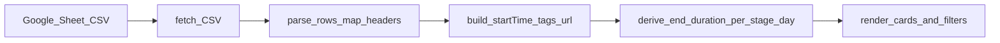

# Google Sheet schedule datasource

## Context

- Current loader: [`index.html`](index.html) `fetchEvents()` uses [`data/events.json`](data/events.json) with `{ startTime, endTime, duration, summary, location, description }` and derives `clean_title`; cards render via `renderEventCard()`; filters in `filterEvents()` use date/location/artist/selection.
- Your spreadsheet ID: `1hrvRIKI55gMI-JnQ4Hjb3yyAnCbC_Q2H_dZUwvGes5g`. Snapshot in [`uploads/edit-0.md`](uploads/edit-0.md) shows columns: **stage**, **band**, **date** (`2026.06.18.` style), **time** (`HH:mm` sometimes `H:mm`), plus **sample set URL** (header typo `samlpe` in the snapshot—match robustly), and **tags**.

## Sheet access (browser `fetch`)

- Use the **CSV export URL** pattern (works for “anyone can view”):

  `https://docs.google.com/spreadsheets/d/{SPREADSHEET_ID}/export?format=csv&gid={GID}`

- Put **`SPREADSHEET_ID`**, **`GID`** (gid of the exact tab exporting the lineup), and optional **`&single=true`** as small constants near the top of the script block in [`index.html`](index.html).
- Implement `fetch()` + **`cache: 'no-store'`** (or cache-busting query param) so editors see updates sooner; surface a readable error UI if the response is empty or CSV parse fails.

## CSV → canonical event objects

1. Parse CSV rows (reuse a minimal RFC-style parser handling quoted commas, or paste a proven ~20-line `parseCsv`).
2. **Header-based mapping**: build a `{ normalizedHeader → columnIndex }` map for the first row. Match keys case-insensitive and tolerate the **“samlpe”** typo for the sample-set column (`includes('sample') && includes('url')` or fuzzy match).

| Sheet column | Canonical field |
|---|---|
| band | `summary` |
| stage | `location` (after normalization, see below) |
| date + time | `startTime` (ISO local string; see TZ note) |
| sample set URL | `sampleSetUrl` (trim; empty ok) |
| tags | `tags` as `string[]` — split on comma, trim, drop empties |

3. **Skip** rows with missing band or missing date/time.
4. **Timezone**: Build ISO strings in a fixed IANA zone (recommend **`Europe/Budapest`** to match the event). Use a small helper (e.g. `Temporal` if available, or manual `Date` with explicit offset for June) so `startTime` matches what the rest of the app expects.

## `endTime` and `duration` (sheet has no end column)

The app and ICS flow require `endTime` and `duration` ([`generateIcsContent`](index.html), duration labels in cards).

- **Sort** parsed events by `(normalizedLocation, calendarDateFromSheet, startTime)`.
- For each **(location, sheet date)** group, **sort by start** and set **endTime = next row’s startTime** on the same group.
- **Last slot** in that group: set **endTime = startTime + 2 hours** (constant `DEFAULT_SLOT_HOURS = 2`) so calendar export still works. *If you later add an explicit end column, this block is the only place to extend.*

## Stage name normalization

[`STAGE_STYLES`](index.html) keys are uppercase (`DAAD STAGE`, `THE DOME`, …), while the sheet uses title case (`Daad Stage`, `AM/Beach`, …). Add `normalizeStageName(raw)` that maps known variants to those keys (string map or normalize + special-case `AM/Beach` → `AM/BEACH`) so colors stay consistent.

## UI: display new fields

- **`renderEventCard`**: Under the title/subline, add:
  - Optional **link** when `sampleSetUrl` looks like `http(s)://` (escape text; `rel="noopener noreferrer"` `target="_blank"`; stop click propagation on the anchor so it doesn’t toggle selection).
  - **Tags** as compact pills (reuse existing subtle border/text classes; empty `tags` omits the block).

## UI: tag filter

- Add a **`<select id="tagFilter">`** in the filter grid in [`index.html`](index.html) (first option “All tags”). Consider widening the grid (e.g. `md:grid-cols-5` or two rows) for layout balance.
- After `fetchEvents`, compute **unique tags** from all events (sorted A–Z) and populate options.
- Extend **`filterEvents`**: `matchesTag` = no filter value **or** `event.tags.includes(selectedTag)` (exact match on normalized tag strings).
- Wire `change` listener; pass `'tagFilter'` into existing analytics pattern if `sa_event` is used for other filters.

## Optional / follow-up (out of scope unless you want it)

- Keep [`data/events.json`](data/events.json) as offline fallback (try sheet first, catch → local JSON) — only if you want resilience when Google is down.
- Regenerate [`ics/daad-2025-full-schedule.ics`](ics/daad-2025-full-schedule.ics) from the sheet via a separate script (not required for the live page).

## Verification

- Confirm chosen **`gid`** matches the lineup tab (open sheet → URL shows `gid=`).
- Smoke test: filters (including tag), selection persistence (IDs unchanged in shape), ICS downloadstill has plausible end times.
