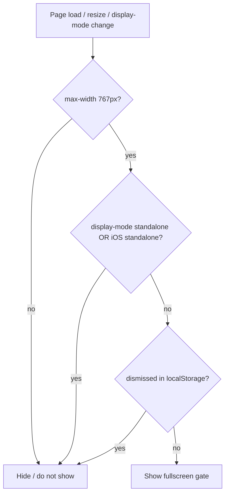

# Mobile browser fullscreen install overlay (non-PWA only)

## Detection (reliable pattern you already use)

Treat as **PWA / installed** when either is true (same as today’s [`setupIosInstallHint`](index.html) logic):

- `window.matchMedia('(display-mode: standalone)').matches` — Chrome/Android installed PWAs, many desktop installed PWAs
- `window.navigator.standalone === true` — iOS Safari “Add to Home Screen”

Optional hardening (small addition): also treat `(display-mode: fullscreen)` as installed for edge cases where the shell reports fullscreen instead of standalone; your [manifest.json](manifest.json) uses `standalone`, so this is defensive only.

**Show the gate** when:

- **Not** installed per above, **and**
- Viewport matches **mobile-only** (your choice): e.g. `window.matchMedia('(max-width: 767px)').matches` — aligns with [`MORE_FILTERS_MIN_WIDTH = 768`](index.html) already used in the same script, **and**
- User has not permanently dismissed the gate (see below).

Hide the gate when any of those fail (e.g. user opens the installed app → standalone → no overlay).

## UI / behavior

- Add a **single** root element (or inject like the current bar): `position: fixed; inset: 0;` **`z-index` above the schedule loading overlay** ([`#scheduleLoadingOverlay` uses `z-[100]`](index.html) — use e.g. `z-[110]`).
- **Blocking**: `pointer-events: auto` on the overlay; `inert` on the main app root **or** rely on overlay capturing all clicks (simpler: high z-index + no “click-through”). Prefer **`role="dialog"`**, **`aria-modal="true"`**, **focus** on the primary action or heading for a11y.
- Content: short title + **iOS** (Share → Add to Home Screen) + **Android** (Install app / ⋮ menu / Add to Home screen — keep generic because `beforeinstallprompt` is not guaranteed).
- **Dismiss** (“Continue in browser” / “Not now”): set `localStorage` (new key, e.g. `daadInstallGateDismissed`), remove/hide overlay — same practical pattern as today’s [`daadIosInstallHintDismissed`](index.html), but one key for all mobile browsers.

## Consolidate with existing iOS bar

Remove or **disable** [`setupIosInstallHint`](index.html): the new gate is a **strict superset** (iOS non-standalone + Android mobile browser). Showing both would duplicate UX.

## React to changes

- Subscribe to `matchMedia('(max-width: 767px)')` **and** `matchMedia('(display-mode: standalone)')` **`change`** events so if the user installs from the same tab (rare) or rotates/resizes across the breakpoint, the overlay visibility stays correct without a full reload.

## Files touched

- **[index.html](index.html)** only: CSS for the overlay (or Tailwind classes inline), markup or scripted mount, small JS module-style IIFE next to existing SW/init code, delete/replace `setupIosInstallHint`.

No manifest or service worker changes required for detection; [manifest.json](manifest.json) already declares `display: standalone`.

## Testing checklist

- iPhone Safari **in tab**: overlay visible; after Add to Home Screen and opening the saved icon: **no** overlay.
- Android Chrome **in tab** (narrow): overlay visible; after install/open from launcher: **no** overlay.
- Desktop browser (wide): **no** overlay.
- Dismiss + `localStorage`: overlay stays off until storage cleared.
- Loading overlay still appears **under** the gate if both show briefly (acceptable); optionally hide loading until gate resolved only if you see visual glitches (likely unnecessary).
